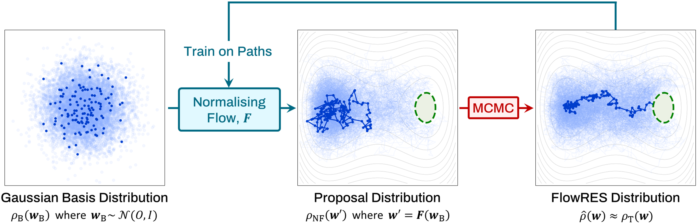

<a name="readme-top"></a>

[](https://zenodo.org/doi/10.5281/zenodo.13730315)

[![LinkedIn][linkedin-shield]][linkedin-url]
[![MIT License][license-shield]][license-url]


<div align="center">
  <h1 align="center">Efficient Rare Event Sampling with Unsupervised
Normalising Flows</h1>
  <br />
  <a href="https://github.com/SolomonAsghar/Efficient-Rare-Event-Sampling-with-Unsupervised-Normalising-Flows">
    
  </a>
  <p align="justify">
    <br />
    This repo contains code used in the paper "Efficient Rare Event Sampling with Unsupervised Normalising Flows". A novel framework (FlowRES) is introduced that uses unsupervised normalising flow neural networks to enhance Monte Carlo sampling of rare events by generating high-quality nonlocal Monte Carlo proposals, featuring key advantages over established path samplers. 
    <p align="center">
    <a target="_blank" href="https://arxiv.org/pdf/2401.01072.pdf"><strong>Read the paper »</strong></a>
    </p>
    <br />
  </p>
</div>

# System Requirements
## Hardware requirements
FlowRES can be run on any standard computer with enough RAM to support the simulations defined by the user. The runtimes we report (`demo` notebooks) come from an old midrange desktop with the following specs:

RAM: 16 GB

CPU: 6 cores, 3.2 GHz/core

Runtimes will be substantially lower if CUDA-enabled GPUs are available. 

## Software requirements
### OS Requirements
FlowRES is compatible with Windows and Unix operating systems. It has been tested on Rocky Linux 8 and Windows 10.

### Dependencies
FlowRES runs using Python 3 with following libraries:

[![MatPlotLib][MatPlotLib-badge]][MatPlotLib-url]

[![NumPy][NumPy-badge]][NumPy-url]

[![SciPy][SciPy-badge]][SciPy-url]

[![TensorFlow][TensorFlow-badge]][TensorFlow-url]


# Installation Guide
Once the required libraries are installed, simply clone the repository with git:
```
git clone https://github.com/SolomonAsghar/FlowRES.git
```
This should only take ~1 min. After cloning the repo, you will be able to run the notebooks included in `demo`. Note that `software` and `demo` must remain in the same directory.

# Usage Instructions and Demo

We provide two instructional IPython notebooks in the `demo` folder, guiding users through applying FlowRES to simulate active and passive Brownian particles exploring double well potentials.
These demos allow for reproduction of select figures from the FlowRES paper. Each demo contains information about expected runtime for intensive cells. Cells without explicitly mentioned runtimes should be expected to run in well under a minute. Without GPU acceleration, `demo/DoubleWell_Passive` takes ca. 60 mins to run and `demo/DoubleWell_Active` takes ca. 90 mins.


Demos are not included for the final two systems shown in the paper due to the longer runtimes of these simulations.
However, the code associated with these systems is provided (see `software/BarrierTrap.py` and `software/DoubleChannel.py` for the potentials, and refer to the paper for parameters used). Straightforward modification of the demo notebooks will allow interested users (ideally with CUDA GPU availability) to reproduce all figures from the paper.

<!-- LICENSE -->
# License

Distributed under the MIT License. See `LICENSE.txt` for more information.


<!-- CONTACT -->
# Contact

Solomon Asghar - solomon.asghar.20@ucl.ac.uk


<!-- ACKNOWLEDGMENTS -->
# Acknowledgments

SA, QXP and GV are grateful to the studentship
funded by the A*STAR-UCL Research Attachment Programme through the EPSRC M3S CDT (EP/L015862/1). RN acknowledge the support by the Singapore Ministry of Education through the Academic Research Tier 2 Fund (MOE2019-T2-2-010)
and Tier 1 grant (RG59/21).

<p align="right">(<a href="#readme-top">back to top</a>)</p>


<!-- MARKDOWN LINKS & IMAGES -->
<!-- https://www.markdownguide.org/basic-syntax/#reference-style-links -->
[contributors-shield]: https://img.shields.io/github/contributors/github_username/repo_name.svg?style=for-the-badge
[contributors-url]: https://github.com/github_username/repo_name/graphs/contributors
[forks-shield]: https://img.shields.io/github/forks/github_username/repo_name.svg?style=for-the-badge
[forks-url]: https://github.com/github_username/repo_name/network/members
[stars-shield]: https://img.shields.io/github/stars/github_username/repo_name.svg?style=for-the-badge
[stars-url]: https://github.com/github_username/repo_name/stargazers
[issues-shield]: https://img.shields.io/github/issues/github_username/repo_name.svg?style=for-the-badge
[issues-url]: https://github.com/github_username/repo_name/issues
[license-shield]: https://img.shields.io/github/license/othneildrew/Best-README-Template.svg?style=for-the-badge
[license-url]: https://github.com/SolomonAsghar/Efficient-Rare-Event-Sampling-with-Unsupervised-Normalising-Flows/blob/master/LICENSE.txt
[linkedin-shield]: https://img.shields.io/badge/-LinkedIn-black.svg?style=for-the-badge&logo=linkedin&colorB=555
[linkedin-url]: https://www.linkedin.com/in/solomon-asghar-12b3a0215/
[product-screenshot]: images/screenshot.png
[Next.js]: https://img.shields.io/badge/next.js-000000?style=for-the-badge&logo=nextdotjs&logoColor=white
[Next-url]: https://nextjs.org/
[React.js]: https://img.shields.io/badge/React-20232A?style=for-the-badge&logo=react&logoColor=61DAFB
[React-url]: https://reactjs.org/
[Vue.js]: https://img.shields.io/badge/Vue.js-35495E?style=for-the-badge&logo=vuedotjs&logoColor=4FC08D
[Vue-url]: https://vuejs.org/
[Angular.io]: https://img.shields.io/badge/Angular-DD0031?style=for-the-badge&logo=angular&logoColor=white
[Angular-url]: https://angular.io/
[Svelte.dev]: https://img.shields.io/badge/Svelte-4A4A55?style=for-the-badge&logo=svelte&logoColor=FF3E00
[Svelte-url]: https://svelte.dev/
[Laravel.com]: https://img.shields.io/badge/Laravel-FF2D20?style=for-the-badge&logo=laravel&logoColor=white
[Laravel-url]: https://laravel.com
[Bootstrap.com]: https://img.shields.io/badge/Bootstrap-563D7C?style=for-the-badge&logo=bootstrap&logoColor=white
[Bootstrap-url]: https://getbootstrap.com
[JQuery.com]: https://img.shields.io/badge/jQuery-0769AD?style=for-the-badge&logo=jquery&logoColor=white
[JQuery-url]: https://jquery.com 
[Python-badge]: https://img.shields.io/badge/python-3670A0?style=for-the-badge&logo=python&logoColor=ffdd54
[Python-url]: https://www.python.org/
[NumPy-badge]: https://img.shields.io/badge/numpy-%23013243.svg?style=for-the-badge&logo=numpy&logoColor=white
[NumPy-url]: https://numpy.org/
[TensorFlow-badge]: https://img.shields.io/badge/TensorFlow-%23FF6F00.svg?style=for-the-badge&logo=TensorFlow&logoColor=white
[TensorFlow-url]: https://www.tensorflow.org/
[Keras-badge]: https://img.shields.io/badge/Keras-%23D00000.svg?style=for-the-badge&logo=Keras&logoColor=white
[Keras-url]: https://keras.io/
[SciPy-badge]: https://img.shields.io/badge/SciPy-%230C55A5.svg?style=for-the-badge&logo=scipy&logoColor=%white
[SciPy-url]: https://scipy.org/
[MatPlotLib-badge]: https://img.shields.io/badge/Matplotlib-%23ffffff.svg?style=for-the-badge&logo=Matplotlib&logoColor=black
[MatPlotLib-url]: https://matplotlib.org/
